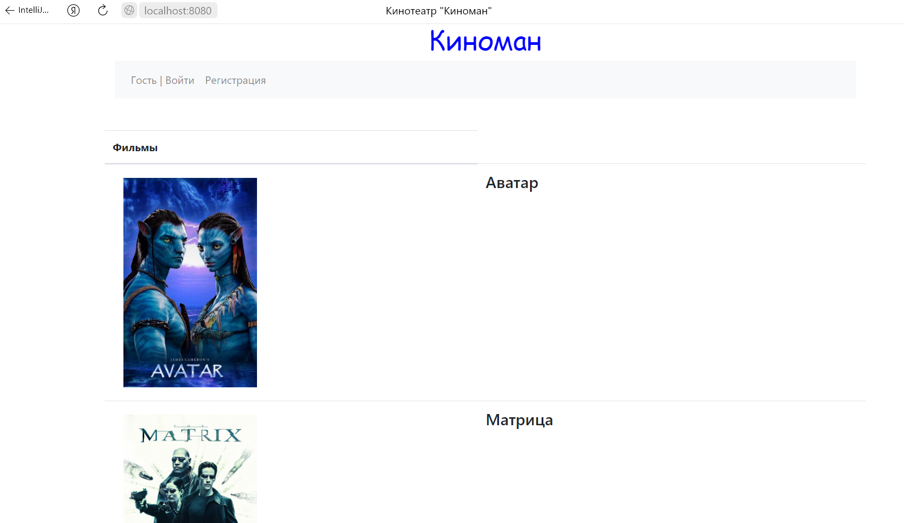
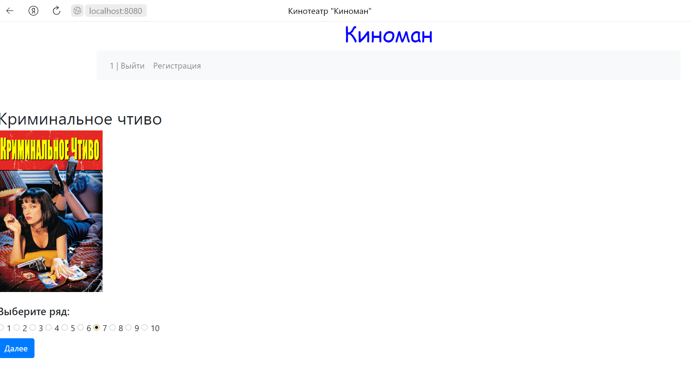
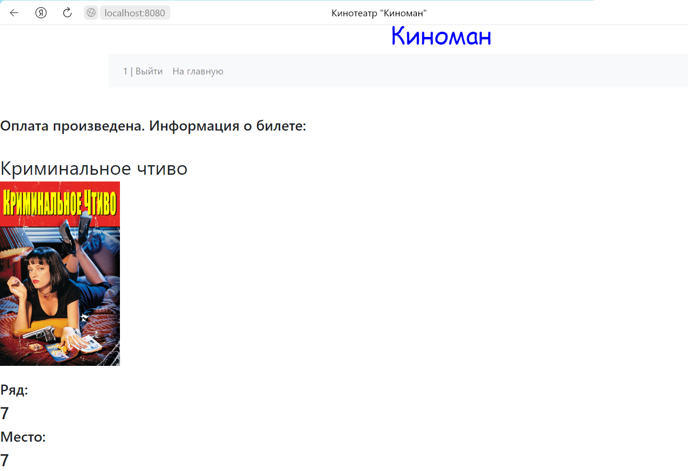
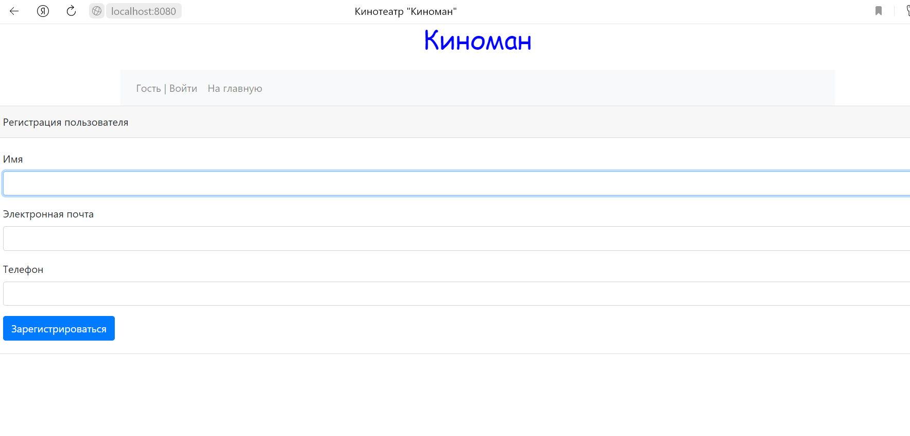
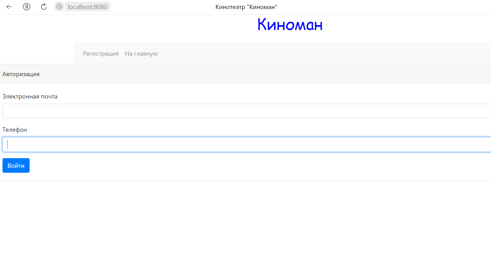

job4j_cinema
===========

## Описание 
В данном проекте разработан сайт для покупки билетов в кинотеатр. При загрузке главной страницы нам предоставляется
возможность выбора фильма. После выбора, мы переходим на страницы выбора ряда, а затем места. После выбору места, пользователю
отображается информация о сеансе и возможность подтвердить покупку, либо вернуть на главную страницу. После подтверждения
покупки загружается информационный экран: либо покупка успешна, либо данное место уже куплено. Если покупка прошла, то билет
добавляется в базу данных. Если перед покупкой пользователь не авторизовался, то его перенаправит на страницу авторизации.
Данные о пользователях также хранятся в базе данных. На страницу авторизации можно перейти с любой из страниц сайта.

## Используемые технологии:
- JDK15
- Maven 3.8.1
- PostgreSQL 13.3
- Spring Boot
- Liquibase
- Bootstrap
- Thymeleaf
- JUnit
- H2
- Mockito

## Требуемое окружение:
- JDK15
- Maven 3.8.1
- PostgreSQL 13.3
- Браузер

## Запуск проекта:
- Создать БД cinema
```jdbc:postgresql://127.0.0.1:5432/cinema```
- Собрать jar файл с помощью команды
```mvn install```
- Запустить приложение c помощью собранного jar-файла
- Перейти по ссылке
```http://localhost:8080/sessions```

## Страницы проекта:

### Главная


### Выбор ряда


### Выбор места


### Информация


### Место занято


### Покупка успешна


### Регистрация


### Авторизация
